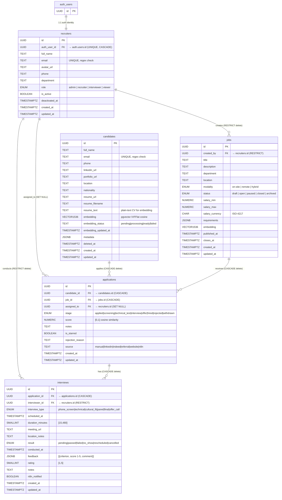

# Schema ERD — AI Recruitment Platform ATS
> Generated by **db-agent** (db-skill v1.0.0)  
> Migration: `20260614061500_initial_ats_schema`

## Entity-Relationship Diagram



---

## Tables Summary

| Table | PK | FK count | pgvector | RLS | moddatetime |
|---|---|---|---|---|---|
| `recruiters`   | UUID | 1 (auth.users) | — | ✅ | ✅ |
| `jobs`         | UUID | 1 (recruiters) | ✅ 1536-dim | ✅ | ✅ |
| `candidates`   | UUID | — | ✅ 1536-dim | ✅ | ✅ |
| `applications` | UUID | 3 (candidates, jobs, recruiters) | — | ✅ | ✅ |
| `interviews`   | UUID | 2 (applications, recruiters) | — | ✅ | ✅ |

---

## ENUM Types

| Type | Values |
|---|---|
| `recruiter_role`    | `admin`, `recruiter`, `interviewer`, `viewer` |
| `job_status`        | `draft`, `open`, `paused`, `closed`, `archived` |
| `job_modality`      | `on-site`, `remote`, `hybrid` |
| `candidate_stage`   | `applied`, `screening`, `technical_test`, `interview`, `offer`, `hired`, `rejected`, `withdrawn` |
| `interview_result`  | `pending`, `passed`, `failed`, `no_show`, `rescheduled`, `cancelled` |
| `interview_type`    | `phone_screen`, `technical`, `cultural_fit`, `panel`, `final`, `offer_call` |

---

## pgvector Indexes

| Table | Column | Type | Distance | Lists |
|---|---|---|---|---|
| `jobs` | `embedding` | IVFFlat | cosine | 100 |
| `candidates` | `embedding` | IVFFlat | cosine | 100 |

**Semantic ranking query example:**
```sql
SELECT
  c.id,
  c.full_name,
  c.email,
  1 - (c.embedding <=> j.embedding) AS similarity_score
FROM candidates c
CROSS JOIN jobs j
WHERE j.id = '<job-uuid>'
  AND c.embedding_status = 'ready'
ORDER BY similarity_score DESC
LIMIT 20;
```

---

## RLS Access Matrix

| Role | recruiters | jobs | candidates | applications | interviews |
|---|---|---|---|---|---|
| `admin` | ALL | ALL | ALL | ALL | ALL |
| `recruiter` | own row + admin | ALL | ALL | ALL | ALL |
| `interviewer` | own row | open only | assigned only | assigned only | own sessions |
| `viewer` | own row | open only | ❌ | ❌ | ❌ |
| `service_role` (n8n) | bypasses RLS | bypasses RLS | bypasses RLS | bypasses RLS | bypasses RLS |

---

## n8n Webhook Events Mapped to Schema Fields

| Event | Table affected | Field updated |
|---|---|---|
| `cv.ingested` | `candidates` | `embedding`, `embedding_status`, `embedding_updated_at` |
| `application.scored` | `applications` | `score` |
| `interview.scheduled` | `interviews` | `n8n_notified = TRUE` |
| `stage.advanced` | `applications` | `stage` |
